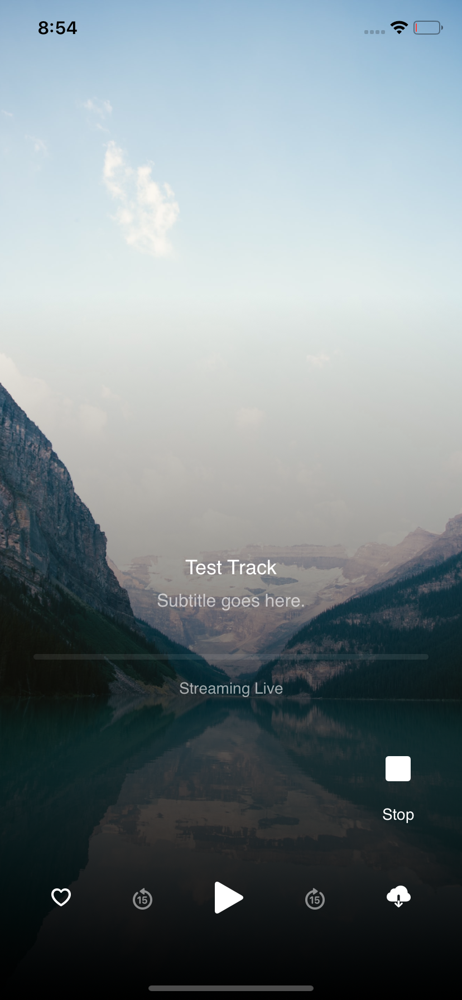

# Serene Audio Player

Serene Audio Player is a fully functional beautiful audio player developed in SwiftUI. It can play live streams from URLs as well as local bundled files located in a specific folder directory.



### Features!

  - Play an mp3 file bundled with the app (Using SereneAudioFilePlayer())
  - Play an mp3 file from an online source (Using SereneAudioStreamPlayer())

You can also:
  - Download audio files for offline usage to the user's device by assigning a directory folder name. (experimental)
  - The user can favourite tracks in the player view (experimental)

### How to Use (Installation)

Serene Audio Player requires iOS 13+ as it is a SwiftUI package.

1) Add SereneAudioPlayer to your project using Swift Package Manager (copy and paste this link when asked after selecting File > Swift Packages > Add Package Dependency:

```swift
https://github.com/amrezo/SereneAudioPlayer.git
```

2) Import SereneAudioPlayer into your content view:

```swift
import SwiftUI
import SereneAudioPlayer
```

3) Create a track using ```Track()``` :

```swift
var track: Track = Track(image: "nature", title: "Test Track", subtitle: "Subtitle goes here.", recording: "clarity", streamURL: "https://serene-music.s3.us-east-2.amazonaws.com/clarity.mp3", favourited: false)
```

- image: an image located in the Assets of the app project
- title: Main title of the track
- subtitle: The accompanying subtitle of the track
- recording: the name of the mp3 file bundled with the app (located within the app files hierarchy).
- streamURL: the location of the mp3 file online (used for streaming).
- favourited: whether the track is favourited by the user or not,

4) Use ```SereneAudioFilePlayer()``` for playing a local file, or ```SereneAudioStreamPlayer()``` to play a streamed mp3 file online.

5) Be sure to include the Track object and a folder name for the directory to be created when a user downloads the track for offline usage. For example, using the previously created ```track```, add the follwoing inside your content view body: 

```swift
SereneAudioFilePlayer(track: track, folderName: "Music")
```

### Todo
- Create functionality to alternate between stream or file automatically if file already exists (downloaded by user for offline usage)
- Enable favouriting and create function to save favourite
- Enhance UI
- More to come...open to suggestions and inquiries.

### Collaboration

I am open to collaborators helping me develop this library. Please let me know of any issues that may arise or future developments you want to work on!

### License
---
MIT

